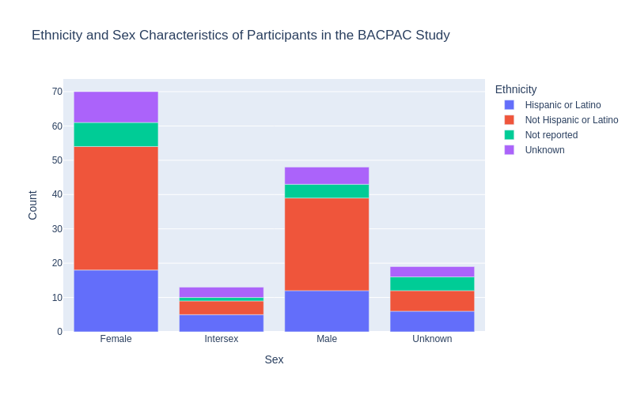
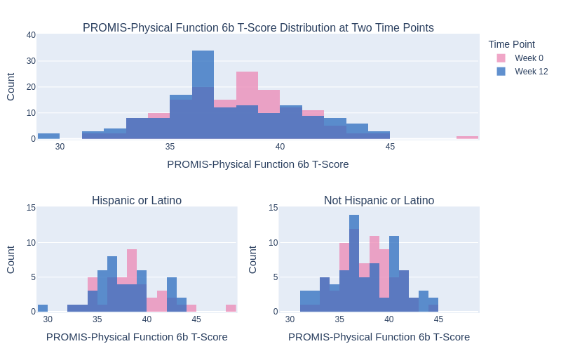

# BACPAC Synthetic Data Analysis

## Qiong Liu
### April 2nd, 2021

In this Jupyter notebook, we used the BACPAC study as an example to demonstrate how to navigate datasets within the workspace in HEAL and conduct data analysis using Python libraries.

## Table of Content
- [Set up notebook](#h1)
- [Pull file objects using the Gen3 SDK](#Pull-file-objects-using-the-Gen3-SDK)
- [Demographic characteristics of participants in BACPAC](#Demographic-characteristics-of-participants-in-BACPAC)
- [Opiod pain medication profiling at two time points](#Opiod-pain-medication-profiling-at-two-time-points)
- [Physical function outcomes](#Physical-function-outcomes)


## Set up notebook


```python
# Uncomment the line to install python libraries by removing #
!pip install kaleido==0.2.1 -q

import pandas as pd
import kaleido
import plotly
import plotly.graph_objects as go
import plotly.express as px
from plotly.subplots import make_subplots
import plotly.io as pio
from pathlib import Path
import numpy as np
import json
import requests
import os

plotly.offline.init_notebook_mode()
from IPython.display import Markdown, Image, display
os.makedirs('img/BACPAC_Synthetic_Data_Analysis')
```

## Query study metadata
Users can query study metadata in HEAL data commons using our metadata service (MDS). The cell below shows how to retrieve the metadata of the BACPAC study by interacting with the gen3 MDS endpoint.


```python
# Query the metadata of BACPAC using the project number "1U24AR076730-01"
response=requests.get("https://healdata.org/mds/metadata?data=True&limit=1000&gen3_discovery.project_number=1U24AR076730-01")
metadata_text=response.text
metadata_object=json.loads(metadata_text)
meta_df = pd.json_normalize([sub['gen3_discovery'] for sub in metadata_object.values() if 'gen3_discovery' in sub.keys()])
Markdown(meta_df[['research_focus_area', 'study_metadata.minimal_info.study_description', 'institutions']].transpose().to_markdown())
```


|                                               | 0                                                                                                                                                                                                                                                                                                                                                                                                                                                                                                                                                                                                                                                                                                                                                                                                                                                                                                                                                                                                                                                                                                                                                                                                                          |
|:----------------------------------------------|:---------------------------------------------------------------------------------------------------------------------------------------------------------------------------------------------------------------------------------------------------------------------------------------------------------------------------------------------------------------------------------------------------------------------------------------------------------------------------------------------------------------------------------------------------------------------------------------------------------------------------------------------------------------------------------------------------------------------------------------------------------------------------------------------------------------------------------------------------------------------------------------------------------------------------------------------------------------------------------------------------------------------------------------------------------------------------------------------------------------------------------------------------------------------------------------------------------------------------|
| research_focus_area                           | Clinical Research in Pain Management                                                                                                                                                                                                                                                                                                                                                                                                                                                                                                                                                                                                                                                                                                                                                                                                                                                                                                                                                                                                                                                                                                                                                                                       |
| study_metadata.minimal_info.study_description | The BACPAC Research Programs Data Integration, Algorithm Development, and Operations Management Center (DAC) will bring cohesion to research performed by the participating Mechanistic Research Centers, Technology Research Sites, and Phase 2 Clinical Trials Centers. DAC Investigators will share their vision and provide scientific leadership and organizational support to the BACPAC Consortium. The research plan consists of supporting design and conduct of clinical trials with precision interventions that focus on identifying the best treatments for individual patients. The DAC will enhance collaboration and research progress with experienced leadership, innovative design and analysis methodologies, comprehensive research operations support, a state-of-the-art data management and integration system, and superior administrative support. This integrated structure will set the stage for technology assessments, solicitation of patient input and utilities, and the evaluation of high-impact interventions through the innovative design and sound execution of clinical trials, leading to effective personalized treatment approaches for patients with chronic lower back pain. |
| institutions                                  | UNIV OF NORTH CAROLINA CHAPEL HILL                                                                                                                                                                                                                                                                                                                                                                                                                                                                                                                                                                                                                                                                                                                                                                                                                                                                                                                                                                                                                                                                                                                                                                                         |


## Pull file objects using the Gen3 SDK


```python
!gen3 drs-pull object dg.H34L/80f0a338-18e0-48de-b70f-cdabd63f67d9
!gen3 drs-pull object dg.H34L/530fd95c-48b6-488e-a699-9377180bd82d
!gen3 drs-pull object dg.H34L/654d7f1f-b61c-49a9-8a74-c82400fa4c27
```

    {"succeeded": ["dg.H34L/80f0a338-18e0-48de-b70f-cdabd63f67d9"], "failed": []}
    {"succeeded": ["dg.H34L/530fd95c-48b6-488e-a699-9377180bd82d"], "failed": []}
    {"succeeded": ["dg.H34L/654d7f1f-b61c-49a9-8a74-c82400fa4c27"], "failed": []}


## Demographic characteristics of participants in BACPAC


```python
# Read the demographic tsv file into dataframe
demo_bacpac=pd.read_csv("./participant_SMART.tsv", sep="\t", encoding="utf-8")


# Define age groups within participants
age_list = list(demo_bacpac["age_in_years"])
def age_group(agelist):
    min_age = min(agelist)
    grouplabel1 = str(min_age) + "-55 yr"
    grouplabel2= ">55 yr"
    grouplist = []
    for i in agelist:
        if i <=55:
            grouplist.append(grouplabel1)
        else:
            grouplist.append(grouplabel2)
    return grouplist

agegrouplist = age_group(age_list)
demo_bacpac["age_group"] = agegrouplist

# Compute three frequency tables using demographic factors
df1=pd.crosstab(index=demo_bacpac['race'], columns=demo_bacpac['sex'])
df2=pd.crosstab(index=demo_bacpac['ethnicity'], columns=demo_bacpac['sex'])
df3=pd.crosstab(index=demo_bacpac['age_group'], columns=demo_bacpac['sex'])

# Dsiplay concatenated tables
Markdown(pd.concat([df1, df2, df3], keys=['race', 'ethnicity', 'age_group']).to_markdown())
```


|                                                 |   Female |   Intersex |   Male |   Unknown |
|:------------------------------------------------|---------:|-----------:|-------:|----------:|
| ('race', 'American Indian or Alaska Native')    |        5 |          1 |      3 |         1 |
| ('race', 'Asian')                               |        2 |          0 |      3 |         0 |
| ('race', 'Black or African American')           |        9 |          3 |      6 |         2 |
| ('race', 'Multiple')                            |        5 |          1 |      4 |         0 |
| ('race', 'Native Hawaiian or Pacific Islander') |        5 |          0 |      1 |         2 |
| ('race', 'Not reported')                        |        4 |          2 |      2 |         1 |
| ('race', 'Unknown')                             |        3 |          2 |      3 |         1 |
| ('race', 'White')                               |       37 |          4 |     26 |        12 |
| ('ethnicity', 'Hispanic or Latino')             |       18 |          5 |     12 |         6 |
| ('ethnicity', 'Not Hispanic or Latino')         |       36 |          4 |     27 |         6 |
| ('ethnicity', 'Not reported')                   |        7 |          1 |      4 |         4 |
| ('ethnicity', 'Unknown')                        |        9 |          3 |      5 |         3 |
| ('age_group', '20-55 yr')                       |       42 |          9 |     29 |        14 |
| ('age_group', '>55 yr')                         |       28 |          4 |     19 |         5 |


```python
# Generate a stacked bar chart of participants in BACPAC
new_df2 = pd.DataFrame(df2.stack())
new_df2.reset_index(inplace=True)
new_df2 = new_df2.rename({0:"Count", "sex": "Sex", "ethnicity": "Ethnicity"}, axis="columns")

fig = go.Figure()
fig = px.bar(new_df2, x="Sex", y="Count", color="Ethnicity",
             title= "Ethnicity and Sex Characteristics of Participants in the BACPAC Study",
             width= 800, height = 500)
fig.write_image('img/BACPAC/figure1.png')

Image(filename="img/BACPAC_Synthetic_Data_Analysis/figure1.png")
```





## Opiod pain medication profiling at two time points


```python
# Read substance use tsv file into dataframe
substance_df = pd.read_csv("./substance_use_SMART.tsv", sep="\t", encoding="utf-8")

# Combine substance use df and demographic df based on participant id
def find_participant(mydf, endstr):
    participant_id = []
    for i in list(mydf["submitter_id"]):
        i_participant = i.rstrip(endstr)
        participant_id.append(i_participant)
    return participant_id
substance_participant_id = find_participant(substance_df,"_sc")
substance_df["participant_id"] = substance_participant_id
demo_combine_substance = substance_df.merge(demo_bacpac, left_on="participant_id",
                                            right_on="submitter_id", how="outer")

# Add one property of time point in the df
def find_timepoint(mydf):
    timepoint = []
    for i in list(mydf["visits.submitter_id"]):
        if i.endswith("Week 0"):
            timepoint.append("Week 0")
        else:
            timepoint.append("Week 12")
    return timepoint

demo_combine_substance["time_point"] = find_timepoint(demo_combine_substance)

# Compute a frequency table using opioid medication factor and time point factor
opioid_crosstab = pd.crosstab(index=demo_combine_substance['OPIOID01'],
                              columns=demo_combine_substance['time_point'])
new_opioid = pd.DataFrame(opioid_crosstab.stack())
new_opioid.reset_index(inplace=True)
new_opioid = new_opioid.rename({0:"Count", "OPIOID01": "Taking Opioid", "time_point": "Time Point"},
                               axis="columns")

fig2 = go.Figure()
fig2 =px.bar(new_opioid, x="Taking Opioid", y="Count", color="Taking Opioid",
             facet_row="Time Point", width=800, height=400)
fig2.update_layout(title_text="Self-Report of Opioid Pain Medication Use at Baseline and Twelve Weeks",title_font_size=20)
for data in fig2.data:
    data["width"]=0.6

fig2.write_image('img/BACPAC_Synthetic_Data_Analysis/figure2.png')

Image(filename="img/BACPAC_Synthetic_Data_Analysis/figure2.png")
```


- We observed an increase of participants taking opioid pain medication at the week 12 time point compared to baseline.


```python
# Generate a bar chart showing the opioid taking at two time points in different sex groups
opioid_gender = pd.crosstab(index=[demo_combine_substance['OPIOID01'], demo_combine_substance['sex']],
                            columns=demo_combine_substance['time_point'])
new_opioid_gender = pd.DataFrame(opioid_gender.stack())
new_opioid_gender.reset_index(inplace=True)
new_opioid_gender = new_opioid_gender.rename({0:"Count", "OPIOID01": "Taking Opioid",
                                              "time_point": "Time Point", "sex": "Sex"}, axis="columns")

fig3 = go.Figure()
fig3 = px.bar(new_opioid_gender, y="Sex", x="Count", color="Taking Opioid",
             facet_col="Time Point", width=800, height=400,  orientation='h',
             category_orders={"Sex": ["Intersex", "Unknown", "Male", "Female"]})
fig3.update_layout(title_text="Opioid Pain Medication at Two Time Points in Different Sex Groups", title_font_size=20)

fig3.write_image('img/BACPAC_Synthetic_Data_Analysis/figure3.png')

Image(filename="img/BACPAC_Synthetic_Data_Analysis/figure3.png")


```


- We observed an increase of particpants taking opioid medication at week 12 in both male and femal groups compared to baseline week 0.

## Physical function outcomes
 The cell below uses the Physical Function 6b T-Score to display physical function outcomes in different ethnicity groups at week 0 and week 12.


```python
# Read physical_function_SMART.tsv into dataframe and merge the df with demographic
function_df = pd.read_csv("./physical_function_SMART.tsv", sep="\t", encoding="utf-16")
function_participant_id = find_participant(function_df, "_pf")
function_df["participant_id"] = function_participant_id
demo_combine_function = function_df.merge(demo_bacpac, left_on="participant_id",
                                          right_on="submitter_id", how="outer")
demo_combine_function["time_point"] = find_timepoint(demo_combine_function)

# Summary table of ROMIS-Physical Function 6b T-Score in different ethnicity groups
ethnicity_PRPF6BT = demo_combine_function[["time_point",
                                           "PRPF6BT",
                                           "ethnicity"]].groupby(['time_point','ethnicity']).describe()
Markdown(ethnicity_PRPF6BT.to_markdown())
```


|                                       |   ('PRPF6BT', 'count') |   ('PRPF6BT', 'mean') |   ('PRPF6BT', 'std') |   ('PRPF6BT', 'min') |   ('PRPF6BT', '25%') |   ('PRPF6BT', '50%') |   ('PRPF6BT', '75%') |   ('PRPF6BT', 'max') |
|:--------------------------------------|-----------------------:|----------------------:|---------------------:|---------------------:|---------------------:|---------------------:|---------------------:|---------------------:|
| ('Week 0', 'Hispanic or Latino')      |                     41 |               38.2854 |              3.16501 |                 32.5 |                 36   |                38.5  |               39.3   |                 48.7 |
| ('Week 0', 'Not Hispanic or Latino')  |                     73 |               37.5411 |              2.59823 |                 31.5 |                 35.1 |                37.6  |               39.3   |                 44.2 |
| ('Week 0', 'Not reported')            |                     16 |               37.6125 |              2.93754 |                 33.4 |                 35.1 |                38.05 |               40.2   |                 43.1 |
| ('Week 0', 'Unknown')                 |                     20 |               38.195  |              2.46736 |                 31.5 |                 37.4 |                38.5  |               39.3   |                 42.1 |
| ('Week 12', 'Hispanic or Latino')     |                     41 |               37.5366 |              3.06299 |                 29.1 |                 35.1 |                37.6  |               39.3   |                 43.1 |
| ('Week 12', 'Not Hispanic or Latino') |                     73 |               37.589  |              3.24267 |                 31.5 |                 35.1 |                37.6  |               40.2   |                 44.2 |
| ('Week 12', 'Not reported')           |                     16 |               37.7438 |              2.74007 |                 33.4 |                 36   |                36.8  |               39.525 |                 43.1 |
| ('Week 12', 'Unknown')                |                     20 |               36.925  |              3.26366 |                 29.1 |                 35.1 |                36    |               38.7   |                 44.2 |


```python
# Visualize the distribution of Physical Function 6b T-Score
# at two time points for hispanic and non-hispanic ethnicity groups
fig4 = go.Figure()

fig4 = make_subplots(
    rows=2, cols=2,
    specs=[[{"colspan": 2}, None],
           [{}, {}]],
    subplot_titles=("PROMIS-Physical Function 6b T-Score Distribution at Two Time Points","Hispanic or Latino",
                    "Not Hispanic or Latino"))

fig4.add_trace(go.Histogram(x=demo_combine_function[demo_combine_function["time_point"]=="Week 0"]["PRPF6BT"],
                           marker_color='#EB89B5', opacity=0.75, nbinsx=20, name="Week 0"),
               row=1, col=1)
fig4.add_trace(go.Histogram(x=demo_combine_function[demo_combine_function["time_point"]=="Week 12"]["PRPF6BT"],
                           marker_color='#2B6CBE', opacity=0.75, nbinsx=20, name="Week 12"),
               row=1, col=1)
fig4.add_trace(go.Histogram(x=demo_combine_function[(demo_combine_function["time_point"]=="Week 0")&(demo_combine_function["ethnicity"]=="Hispanic or Latino")]["PRPF6BT"],
                           marker_color='#EB89B5', opacity=0.75, nbinsx=20,showlegend=False),
               row=2, col=1)
fig4.add_trace(go.Histogram(x=demo_combine_function[(demo_combine_function["time_point"]=="Week 12")&(demo_combine_function["ethnicity"]=="Hispanic or Latino")]["PRPF6BT"],
                           marker_color='#2B6CBE', opacity=0.75, nbinsx=20,showlegend=False),
               row=2, col=1)
fig4.add_trace(go.Histogram(x=demo_combine_function[(demo_combine_function["time_point"]=="Week 0")&(demo_combine_function["ethnicity"]=="Not Hispanic or Latino")]["PRPF6BT"],
                           marker_color='#EB89B5', opacity=0.75, nbinsx=20,showlegend=False),
               row=2, col=2)
fig4.add_trace(go.Histogram(x=demo_combine_function[(demo_combine_function["time_point"]=="Week 12")&(demo_combine_function["ethnicity"]=="Not Hispanic or Latino")]["PRPF6BT"],
                           marker_color='#2B6CBE', opacity=0.75, nbinsx=20,showlegend=False),
               row=2, col=2)

fig4.update_layout(barmode='overlay', width=800, height=500,legend_title_text='Time Point')
fig4.update_layout(margin=dict(l=20, r=20, t=50, b=20, pad=2))
fig4.update_yaxes(title_text="Count",
                  title_font_size=15, range=[0, 40], row=1, col=1)
fig4.update_xaxes(title_text="PROMIS-Physical Function 6b T-Score",
                  title_font_size=15,
                  range=[29, 49], row=1, col=1)
fig4.update_yaxes(title_text="Count",
                  title_font_size=15, range=[0, 15], row=2, col=1)
fig4.update_xaxes(title_text="PROMIS-Physical Function 6b T-Score",
                  title_font_size=15, range=[29, 49], row=2, col=1)
fig4.update_yaxes(title_text="Count",
                  title_font_size=15, range=[0, 15], row=2, col=2)
fig4.update_xaxes(title_text="PROMIS-Physical Function 6b T-Score",
                  title_font_size=15, range=[29, 49], row=2, col=2)

fig4.write_image('img/BACPAC_Synthetic_Data_Analysis/figure4.png')

Image(filename="img/BACPAC_Synthetic_Data_Analysis/figure4.png")
```



