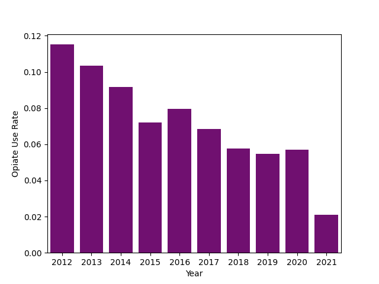
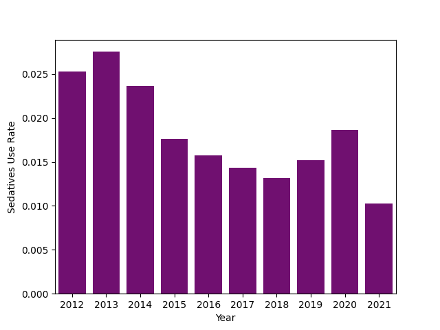
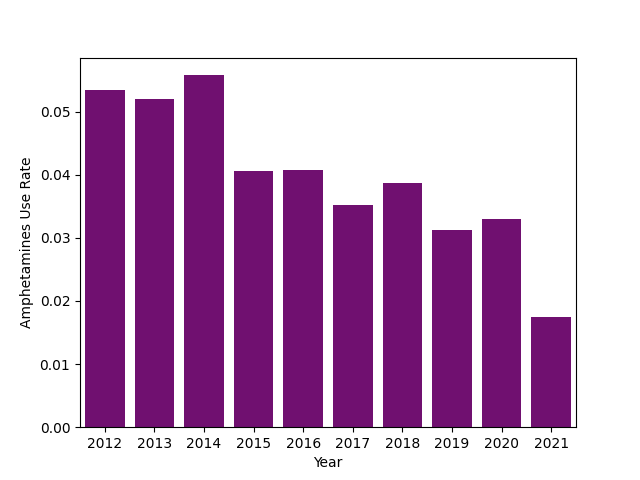
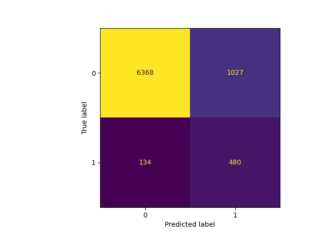

# Monitoring The Future: 12th Grader Opiate Use From 2012 To 2021 - Part 2
#### By J Montgomery Maxwell - Data Science, Sr. Analyst - CTDS

## Analysis Introduction

### About The Data
The Monitoring The Future surveys are a series of surveys that have emerged as a vital tool in measuring the values, behaviors, and lifestyle orientations of American youth. Through a comprehensive series of surveys, these studies offer a unique glimpse into the ever-changing landscape of 12th grade students. There are approximately 1,400 variables across all of the questionnaires; while recognizing the vastness of the available data, our exploration will be primarily focused on a subset of variables deemed particularly relevant to our research.

One of the critical aspects examined in the surveys pertains to the frequency of drug use among students, encompassing a wide array of illicit and recreational substances. In the context of this analysis, specific attention has been limited to surveys which observe instances where students engaged in the use of heroin or other opioid narcotics.

While the investigation of drug use patterns holds significance in understanding the landscape of contemporary American youth, the Monitoring The Future surveys provide a broader canvas for exploration. Our analysis incorporates other topics including, but not limited to, students' perspectives on religion, educational goals, family life dynamics, and work habits. By examining these multidimensional facets, we may gain a holistic understanding of the myriad factors influencing the lives, aspirations, and substance use risks of American students.


```python
!pip install seaborn -q
!pip install matplotlib -q
!pip install scikit-learn -q
!pip install xgboost -q
!pip install imblearn -q

import pandas as pd
import numpy as np
import seaborn as sns
import matplotlib.pyplot as plt
import os

from sklearn.model_selection import train_test_split
from sklearn.linear_model import LogisticRegression
from sklearn.ensemble import RandomForestClassifier
from sklearn.model_selection import cross_validate
from sklearn.svm import SVC
from xgboost import XGBClassifier

from sklearn.metrics import recall_score, precision_score, accuracy_score, confusion_matrix, ConfusionMatrixDisplay
from sklearn.utils import resample

from sklearn.decomposition import PCA
from imblearn.over_sampling import SMOTE
from imblearn.pipeline import Pipeline

from IPython.display import Markdown, Image, display

pd.set_option('future.no_silent_downcasting', True)
os.makedirs('img/MTF_Part2')

import warnings
warnings.simplefilter(action='ignore', category=FutureWarning)
```

## Data Preperation

As in our previous work, we exclude a number of variables due to their strong correlations. For instance, we observed among the survey recipients an expected connection between the number of alcoholic drinks consumed this year and the number of alcoholic drinks consumed in the last 30 days. We believe that the latter variable will serve as a more robust indicator for opiate use, so to streamline our analysis and enhance the veracity of our work, we made the decision to remove the former variable.

After removing a number of observations that were missing data, we were left with approximately 42,000 observations spanning the 10 years of survey data.

Most of the data you see below is either recorded as a binary outcome (1/yes or 0/no), as an ordinal value(i.e., 0 = no drug use, 1 = some drug use, 2 = frequent drug use), or as a categorical feature. The categorical data is encoded and represented as binary data, and the ordinal values were scaled down so that all of the data was within the range of 0 and 1.


```python
random_seed=2023

variable_dict = {
 'V1': 'Year',
 'RESPONDENT_AGE': 'Over18',
 'V13': 'SchoolRegion',
 'V49': 'NumberOfSiblings',
 'V2102': 'Cigarettes/30Days',
 'V2106': 'AlcoholicDrinks/30Days',
 'V2117': 'Marijuana/30Days',
 'V2118': 'LSD/Lifetime',
 'V2121': 'Psychedelics/Lifetime',
 'V2124': 'Cocaine/Lifetime',
 'V2127': 'Amphetamines/Lifetime',
 'V2133': 'Sedatives/Lifetime',
 'V2136': 'Tranquilizers/Lifetime',
 'V2139': 'Heroine/Lifetime',
 'V2142': 'OpioidNarcotics/Lifetime',
 'V2150': 'Sex',
 'V2151': 'Race',
 'V2152': 'RaisedWhere',
 'V2153': 'MaritalStatus',
 'V2155': 'LivesWithFather',
 'V2156': 'LivesWithMother',
 'V2157': 'LivesWithSiblings',
 'V2163': 'FatherEduLvl',
 'V2164': 'MotherEduLvl',
 'V2165': 'MotherHadPaidJobWhileGrowingUp',
 'V2166': 'PoliticalPreference',
 'V2167': 'PoliticalBeliefs',
 'V2169': 'ReligiousServiceAttendenceWkly',
 'V2170': 'ReligionImportance',
 'V2172': 'HighSchoolProgram',
 'V2174': 'SelfRateIntelligence',
 'V2175': 'SchoolDaysMissedIllness/4Weeks',
 'V2176': 'SchoolDaysMissedSkipped/4Weeks',
 'V2177': 'SchoolDaysMissedOther/4Weeks',
 'V2178': 'SkippedClass/4Weeks',
 'V2179': 'AverageGradeHS',
 'V2180': 'LikelyToAttendVocationalSchl',
 'V2181': 'LikelyToServeInMilitary',
 'V2182': 'LikelyToGraduate2YrCollege',
 'V2183': 'LikelyToGraduate4YrCollege',
 'V2184': 'LikelyToAttendGraduateSchl',
 'V2185': 'WantToDoVocationalSchl',
 'V2186': 'WantToServeInMilitary',
 'V2187': 'WantToDo2YrCollege',
 'V2188': 'WantToDo4YrCollege',
 'V2189': 'WantToDoGradSchl',
 'V2190': 'WantToDoNo2ndEd',
 'V2191': 'HrsWorkedPerWeek',
 'V2193': 'MoneyFromOtherSource',
 'V2194': 'EveningsOutPerWeek',
 'V2195': 'DatesHowOften',
 'V2196': 'MilesDrivenPerWeek',
 'V2197': 'DrivingTickets',
 'V2201': 'CarAccidentsLast12Mo',
 'V2459': 'Crack/Lifetime',
}

df_2012 = pd.read_csv('Grade12/ICPSR_34861/DS0001/34861-0001-Data.tsv', sep='\t')
df_2013 = pd.read_csv('Grade12/ICPSR_35218/DS0001/35218-0001-Data.tsv', sep='\t')
df_2014 = pd.read_csv('Grade12/ICPSR_36263/DS0001/36263-0001-Data.tsv', sep='\t')
df_2015 = pd.read_csv('Grade12/ICPSR_36408/DS0001/36408-0001-Data.tsv', sep='\t')
df_2016 = pd.read_csv('Grade12/ICPSR_36798/DS0001/36798-0001-Data.tsv', sep='\t')
df_2017 = pd.read_csv('Grade12/ICPSR_37182/DS0001/37182-0001-Data.tsv', sep='\t')
df_2018 = pd.read_csv('Grade12/ICPSR_37416/DS0001/37416-0001-Data.tsv', sep='\t')
df_2019 = pd.read_csv('Grade12/ICPSR_37841/DS0001/37841-0001-Data.tsv', sep='\t')
df_2020 = pd.read_csv('Grade12/ICPSR_38156/DS0001/38156-0001-Data.tsv', sep='\t')
df_2021 = pd.read_csv('Grade12/ICPSR_38503/DS0001/38503-0001-Data.tsv', sep='\t')

df_list = [df_2012, df_2013, df_2014, df_2015, df_2016, df_2017, df_2018, df_2019, df_2020, df_2021]
year_list = [2012, 2013, 2014, 2015, 2016, 2017, 2018, 2019, 2020, 2021]
```


```python
vars = set(list(df_2012.columns))
for df in df_list:
    vars = set(vars & set(list(df.columns)))

variables = list(vars)
df = pd.concat([x[variables] for x in df_list], ignore_index=True)

df = df[variable_dict.keys()]

# Remove missing data
missing_criteria = (df == -9).sum() < 0.3*len(df.index)
df = df[missing_criteria.index[missing_criteria]]

minimal_missing = []
for i in df.index:
    cnt = sum(df.iloc[i, :] == -9)
    if cnt < 1:
        minimal_missing.append(i)

df = df[df.index.isin(minimal_missing)]

# Combine Opiate Use data
df['OpiateUse'] = ((df['V2142'] != 1) + (df['V2139'] != 1)).astype(int)
df = df.drop(['V2142', 'V2139'], axis=1)

# Rename columns using data dictionary
df.rename(columns=variable_dict, inplace=True)

# Factor categorical data
dummy_cols = ['SchoolRegion', 'Race', 'RaisedWhere', 'MaritalStatus', 'PoliticalPreference', 'PoliticalBeliefs', 'HighSchoolProgram']
dummies = pd.get_dummies(df[dummy_cols], columns=dummy_cols, drop_first=True)
df = pd.concat([df, dummies], axis=1)
df = df.drop(dummy_cols, axis=1)

# Normalize data
df = df.replace({False: 0, True: 1})
years_vec = df['Year']
df = (df-df.min())/(df.max()-df.min())
df['Year'] = years_vec

df = df.reset_index(drop=True)
```

## Analysis And Visualization

### Annual Oppiate Use Rate

Here we find a steady decline in opiate use rates amongst the surveyed 12th graders. There is a significant drop in opiate abuse in 2021, however this abnormal decrease could be from a number of outlying conditions such as the COVID-19 pandemic and the subsequent stay at home orders and work from home school policies.


```python
series = (df.groupby('Year')['OpiateUse'].sum() / df.groupby('Year')['Year'].count())
ax = sns.barplot(x=list(series.index), y=list(series.array), color='purple')
ax.set(xlabel='Year', ylabel='Opiate Use Rate')
plt.close()

ax.figure.savefig('img/MTF_Part2/figure1.png')
Image(filename="img/MTF_Part2/figure1.png")
```





#### Rate Of Illicit Substance Use Coinciding With Opiate Abuse

Below we can see that more than half of all those surveyed who had ever used tranquilzers, cocaine, and pychedelics had also abused opiates or opioid narcotics at somepoint in their lives. Rates of coinciding sedative, amphetamine, and LSD use are not far behind.


```python
drug_use_df = df[['Tranquilizers/Lifetime', 'Amphetamines/Lifetime', 'Sedatives/Lifetime',
    'Marijuana/30Days', 'Cocaine/Lifetime', 'Cigarettes/30Days', 'Psychedelics/Lifetime',
    'AlcoholicDrinks/30Days', 'LSD/Lifetime', 'OpiateUse']]

ratio_dict = {}
for col in drug_use_df.columns:
    ratio = drug_use_df.loc[((drug_use_df[col] > 0) & (drug_use_df['OpiateUse'] > 0))].shape[0] / drug_use_df.loc[(drug_use_df[col] > 0)].shape[0]
    ratio_dict[col] = ratio
ratio_dict.pop('OpiateUse', None)
ratio_dict
```


    {'Tranquilizers/Lifetime': 0.5340777820562187,
     'Amphetamines/Lifetime': 0.41908396946564885,
     'Sedatives/Lifetime': 0.47626186906546725,
     'Marijuana/30Days': 0.21841463414634146,
     'Cocaine/Lifetime': 0.600326264274062,
     'Cigarettes/30Days': 0.29249941217963793,
     'Psychedelics/Lifetime': 0.5078625509609784,
     'AlcoholicDrinks/30Days': 0.14727359585067903,
     'LSD/Lifetime': 0.4786096256684492}


If readers are familiar with the previous analysis on the HEAL platform: *Monitoring The Future: 12th Grader Opiate Use - Part 1*, an undeniable connection was identified by the machine learning models used in that notebook between opioid abuse and other drug use for 12th graders in 2019. While that connection appears to exist again, let's examine if the same descrease in opioid use is present with other drug use amongst 12th graders.

### Annual Cocaine Use Rate


```python
series = (df.groupby('Year')['Cocaine/Lifetime'].sum() / df.groupby('Year')['Year'].count())
ax = sns.barplot(x=list(series.index), y=list(series.array), color='purple')
ax.set(xlabel='Year', ylabel='Cocaine Use Rate')
plt.close()

ax.figure.savefig('img/MTF_Part2/figure2.png')
Image(filename="img/MTF_Part2/figure2.png")
```


### Annual Tranquilzer Use Rate


```python
series = (df.groupby('Year')['Tranquilizers/Lifetime'].sum() / df.groupby('Year')['Year'].count())
ax = sns.barplot(x=list(series.index), y=list(series.array), color='purple')
ax.set(xlabel='Year', ylabel='Tranquilizer Use Rate')
plt.close()

ax.figure.savefig('img/MTF_Part2/figure3.png')
Image(filename="img/MTF_Part2/figure3.png")
```


### Annual Sedatives Use Rate


```python
series = (df.groupby('Year')['Sedatives/Lifetime'].sum() / df.groupby('Year')['Year'].count())
ax = sns.barplot(x=list(series.index), y=list(series.array), color='purple')
ax.set(xlabel='Year', ylabel='Sedatives Use Rate')
plt.close()

ax.figure.savefig('img/MTF_Part2/figure4.png')
Image(filename="img/MTF_Part2/figure4.png")
```





### Annual Amphetamines Use Rate


```python
series = (df.groupby('Year')['Amphetamines/Lifetime'].sum() / df.groupby('Year')['Year'].count())
ax = sns.barplot(x=list(series.index), y=list(series.array), color='purple')
ax.set(xlabel='Year', ylabel='Amphetamines Use Rate')
plt.close()

ax.figure.savefig('img/MTF_Part2/figure5.png')
Image(filename="img/MTF_Part2/figure5.png")
```





While there is a substantial decrease in the use of amphetamines, sedatives, tranquilizers, and cocaine in 2021, we do not see the same slow decline in their usage from 2012 to 2020. It is, however, worth noting the significant degree to which opioids are abused compared to the other illicit substances. Opiate use peaked at over 11% in 2012, while all of the other substances have peaks between 1% and 6%.

**Opiate use is a combined measurement of the heroin and opioid narcotic use survey results.*

## Cross Validation, Hyperparameter Tuning, And Model Selection

The work done in the first example analysis notebook in this series used SMOTE (Synthetic Minority Oversampling Technique) and multiple, simpler classification models, such as logistic regression and random forest classification. This notebook will use the XGB (Extreme Gradient Boosting) classification algorithm. Unlike with the simpler models used previously, the XGBClassifier does not require the use of SMOTE. Instead, we will use the XGBClassifier hyperparameter, 'scale_pos_weight'. When classes are imbalanced, 'scale_pos_weight' is typically set as the ratio of the number of overrepresented observations (no opiate use) to the number of underrepresented observations (opiate use). This hyperparameter scales the gradient of the positive, underrepresented class, thus scaling the errors of the positive class during the model training step.

While 'scale_pos_weight' is taken at the suggested value, most of the other hyperparameters to the XGBClassifier model were tuned using the grid search and 10-fold cross validation methods. In other words, we exhaustively tested multiple combinations of hyperparameters from a subset of possible values and verified the optimal combination of hyperparameters using 10-fold cross validation.

Below you will find the function used for cross validation and the final model used with the tuned hyperparameters.


```python
def pipeline_cross_validation(data, k, pipeline_steps):

    folds = np.array_split(data, k)
    accuracySum = 0
    recallSum = 0
    precisionSum = 0

    for i in range(k):
        train = folds.copy()
        test = folds[i]
        del train[i]
        train = pd.concat(train, sort=False)

        y_train = train.OpiateUse.astype(int)
        X_train = train.drop('OpiateUse', axis=1)

        y_test = test.OpiateUse.astype(int)
        X_test = test.drop('OpiateUse', axis=1)

        pipeline = Pipeline(pipeline_steps).fit(X_train, y_train)
        y_pred = pipeline.predict(X_test)

        accuracySum += accuracy_score(y_test, y_pred)
        recallSum += recall_score(y_test, y_pred)
        precisionSum += precision_score(y_test, y_pred)


    return [accuracySum/k, recallSum/k, precisionSum/k]
```


```python
df1 = df.drop(['Year'], axis=1)
df1 = df1.astype(float)
model = XGBClassifier(
    learning_rate =0.01,
    n_estimators=200,
    max_depth=5,
    min_child_weight=1,
    gamma=0.6,
    subsample=0.8,
    colsample_bytree=0.7,
    objective= 'binary:logistic',
    enable_categorical = 'True',
    seed=random_seed,
    scale_pos_weight = len(df1)/sum(df1['OpiateUse']))

steps =  [('model', model)]
score = pipeline_cross_validation(df1, k=10, pipeline_steps = steps)
print(f'Accuracy: {score[0]} | Precision: {score[1]} | Recall: {score[2]}')
```

    Accuracy: 0.8603258289775144 | Precision: 0.7657892432458844 | Recall: 0.31582818104175825


## Opioid Use Classification

This first iteration of model training, testing, and evaluation will use all 10 years of data spaning from 2012 to 2021. This model will be the same XGBClassifier that was tuned and validated above. After the model is trained, we will examine the model's performance by looking at the model's accuracy, precision, and recall metrics. Model accuracy will tell us the model's rate of correctly classifying both the students who have and have not ever abused opiates; model recall will tell us the model's rate of correctly identifying all of the students who have abused opiates, and model precision will tell us the model's rate of correctly identifying students who have abused opiates amongst all students the model identifies as having used opiates.

After examining the model's performance and the corresponding confusion matrix, we will look at what the model considers to be the most and least relevant features to capturing students' opiate use behavior.


```python
X = df1.drop('OpiateUse', axis=1)
y = df1.OpiateUse
X_train, X_test, y_train, y_test = train_test_split(X, y, test_size=0.2, random_state=random_seed)

model = XGBClassifier(
 learning_rate =0.01,
 n_estimators=200,
 max_depth=5,
 min_child_weight=1,
 gamma=0.6,
 subsample=0.8,
 colsample_bytree=0.7,
 objective= 'binary:logistic',
 seed=random_seed,
 scale_pos_weight = len(df1)/sum(df1['OpiateUse']))

steps =  [('model', model)]

boosted_model = model.fit(X_train, y_train)
y_pred = boosted_model.predict(X_test)
```

### Model Performance

The following model scores are scaled between 0 and 1, with 1 being perfect performance. The scores and the corresponding confusion matrix tells us that the model performs relatively well at identifying students who have ever used opiates illicitly, identifying almost 78% of all students who have used opiates illicitly, and performs well at correctly classifying 85% of all students in either category. However, the model does a poor job at identifying only those who abused opioids amongst the student population. In fact, almost 70% of the students our model says have used opioids illicitly have not.

#### Model Scores


```python
print(f'Accuracy: {accuracy_score(y_test, y_pred)} | Precision: {precision_score(y_test, y_pred)} | Recall: {recall_score(y_test, y_pred)}')
```

    Accuracy: 0.8550380821575727 | Precision: 0.31851360318513605 | Recall: 0.7817589576547231


#### Confuion Matrix


```python
disp = ConfusionMatrixDisplay(confusion_matrix(y_test, y_pred))
disp.plot()
disp.im_.colorbar.remove()
fig = disp.figure_
plt.close()

fig.figure.savefig('img/MTF_Part2/figure6.png')
Image(filename="img/MTF_Part2/figure6.png")
```





## Most Important Features


```python
feature_importance = pd.DataFrame(index=df1.columns.drop('OpiateUse'))
feature_importance[f'Feature Importance'] = (boosted_model.feature_importances_ - min(boosted_model.feature_importances_)) / (max(boosted_model.feature_importances_) - min(boosted_model.feature_importances_))
Markdown(feature_importance.sort_values(by=['Feature Importance'], ascending=False).head(15).to_markdown())
```


|                        |   Feature Importance |
|:-----------------------|---------------------:|
| Amphetamines/Lifetime  |            1         |
| Tranquilizers/Lifetime |            0.449333  |
| Marijuana/30Days       |            0.335475  |
| Sedatives/Lifetime     |            0.152119  |
| AlcoholicDrinks/30Days |            0.129192  |
| Cigarettes/30Days      |            0.105862  |
| LivesWithSiblings      |            0.0666517 |
| Psychedelics/Lifetime  |            0.0630031 |
| Cocaine/Lifetime       |            0.0601336 |
| MilesDrivenPerWeek     |            0.0462572 |
| LSD/Lifetime           |            0.0363287 |
| DrivingTickets         |            0.0314236 |
| SkippedClass/4Weeks    |            0.02358   |
| MoneyFromOtherSource   |            0.0222268 |
| LivesWithMother        |            0.021669  |


## Least Important Features


```python
Markdown(feature_importance.sort_values(by=['Feature Importance'], ascending=False).tail(15).to_markdown())
```


|                                |   Feature Importance |
|:-------------------------------|---------------------:|
| PoliticalPreference_2          |           0.00565269 |
| MotherEduLvl                   |           0.00560381 |
| PoliticalBeliefs_2             |           0.00553094 |
| MotherHadPaidJobWhileGrowingUp |           0.00535169 |
| RaisedWhere_9                  |           0.00510992 |
| Crack/Lifetime                 |           0.00484198 |
| HrsWorkedPerWeek               |           0.00477158 |
| DatesHowOften                  |           0.00447595 |
| RaisedWhere_4                  |           0.00430372 |
| RaisedWhere_8                  |           0.00428398 |
| HighSchoolProgram_4            |           0.00370746 |
| MaritalStatus_2                |           0.00318217 |
| Over18                         |           0.00306294 |
| PoliticalPreference_3          |           0.00255435 |
| PoliticalPreference_7          |           0          |


Above we see the 15 most and least important features ranked by their normalized feature importance scores. These feature scores are an indication of the relative amount each feature improves upon the performance of the model when making a decision along the given feature. As with our work in part one, we find that the students' use of other illicit substances are the most telling indicators as to whether a student will use opiates or opioid narcotics. We also find that the students race, political preference or beliefs, and where students are raised gives little to no indication towards whether they will abuse opioids.

# Annual Opioid Use Classification

Next we will rerun this analysis but focus on only one year of data at a time. We will use the same hyperparameters as before for these newly trained models, since the computation for hyperparameter tuning takes a significant amount of time. After training the 10 models for the 10 years of data, we will again examine the models' performance and ranked feature importance.

## Training And Testing Model On Annual Data


```python
feature_importance = pd.DataFrame(index=df1.columns.drop('OpiateUse'))
classification_scores = pd.DataFrame({'Metric': ['Accuracy', 'Precision', 'Recall']})

for year in year_list:

    df_annual = df[df['Year'] == year]
    df_annual = df_annual.drop(['Year'], axis=1)

    df_annual = df_annual.astype(float)
    X = df_annual.drop('OpiateUse', axis=1)
    y = df_annual.OpiateUse.astype(int)
    X_train, X_test, y_train, y_test = train_test_split(X, y, test_size=0.2, random_state=random_seed)


    model = XGBClassifier(
        learning_rate =0.01,
        n_estimators=200,
        max_depth=5,
        min_child_weight=1,
        gamma=0.6,
        subsample=0.8,
        colsample_bytree=0.7,
        objective= 'binary:logistic',
        enable_categorical=True,
        seed=random_seed,
        scale_pos_weight = len(df_annual)/sum(df_annual['OpiateUse']))

    boosted_model = model.fit(X_train, y_train)
    y_pred = boosted_model.predict(X_test)

    feature_importance[f'Feature Importance {year}'] = (boosted_model.feature_importances_ - min(boosted_model.feature_importances_)) / (max(boosted_model.feature_importances_) - min(boosted_model.feature_importances_))
    classification_scores[f'Model Performance {year}'] = [accuracy_score(y_test, y_pred),  precision_score(y_test, y_pred), recall_score(y_test, y_pred)]
```

## Annual Accuracy And Precision Scores

Below we can see that for the first few years our model's performance is only slightly below the previous performance of the model using all 10 years of data. In 2020 and 2021, the models do not perform nearly as well as the models trained on prior annual data or the model trained using all of the data. The underperformance of the models from earlier years compared to our first model is to be expected, as we are training those models on a much smaller subset of data. However, the poor performance of the later models cannot be completely explained by the difference in size of the training data. The lower performance of the models from 2020 and 2021 may be explained by the disruption to behavior caused by the COVID-19 pandemic, but may also be exlpained by the massive decrease in the opioid use rate of the 12th graders surveyed in 2021.


```python
Markdown(classification_scores.to_markdown())
```


|    | Metric    |   Model Performance 2012 |   Model Performance 2013 |   Model Performance 2014 |   Model Performance 2015 |   Model Performance 2016 |   Model Performance 2017 |   Model Performance 2018 |   Model Performance 2019 |   Model Performance 2020 |   Model Performance 2021 |
|---:|:----------|-------------------------:|-------------------------:|-------------------------:|-------------------------:|-------------------------:|-------------------------:|-------------------------:|-------------------------:|-------------------------:|-------------------------:|
|  0 | Accuracy  |                 0.864261 |                 0.871503 |                 0.892216 |                 0.89576  |                 0.891626 |                 0.917513 |                 0.91247  |                 0.911633 |                 0.921875 |                 0.9681   |
|  1 | Precision |                 0.444444 |                 0.42246  |                 0.476923 |                 0.351852 |                 0.391667 |                 0.488636 |                 0.344086 |                 0.358696 |                 0.388889 |                 0.4      |
|  2 | Recall    |                 0.75188  |                 0.669492 |                 0.738095 |                 0.44186  |                 0.758065 |                 0.68254  |                 0.727273 |                 0.622642 |                 0.4375   |                 0.555556 |


## Most important features each year

Like before, we see the same relation between between general illicit substance use and illicit opiate use. It is worth noting that the use of tranqulizers and amphetamines typically took the top 1 and 2 positions for most influential features until 2021, when they fell to the 4th and 5th ranking. This is another indicator that something significant shifted in our model's classification of 12th grader opiate use.


```python
df12 = pd.DataFrame(feature_importance.sort_values(by=['Feature Importance 2012'], ascending=False)['Feature Importance 2012']).head(10).reset_index(names=['Feature'])
df12['Feature Importance 2012'] = df12['Feature'] +" - "+ df12["Feature Importance 2012"].astype(str)
df12 = df12.drop(['Feature'], axis=1)
df13 = pd.DataFrame(feature_importance.sort_values(by=['Feature Importance 2013'], ascending=False)['Feature Importance 2013']).head(10).reset_index(names=['Feature'])
df13['Feature Importance 2013'] = df13['Feature'] +" - "+ df13["Feature Importance 2013"].astype(str)
df13 = df13.drop(['Feature'], axis=1)
df14 = pd.DataFrame(feature_importance.sort_values(by=['Feature Importance 2014'], ascending=False)['Feature Importance 2014']).head(10).reset_index(names=['Feature'])
df14['Feature Importance 2014'] = df14['Feature'] +" - "+ df14["Feature Importance 2014"].astype(str)
df14 = df14.drop(['Feature'], axis=1)
df15 = pd.DataFrame(feature_importance.sort_values(by=['Feature Importance 2015'], ascending=False)['Feature Importance 2015']).head(10).reset_index(names=['Feature'])
df15['Feature Importance 2015'] = df15['Feature'] +" - "+ df15["Feature Importance 2015"].astype(str)
df15 = df15.drop(['Feature'], axis=1)
df16 = pd.DataFrame(feature_importance.sort_values(by=['Feature Importance 2016'], ascending=False)['Feature Importance 2016']).head(10).reset_index(names=['Feature'])
df16['Feature Importance 2016'] = df16['Feature'] +" - "+ df16["Feature Importance 2016"].astype(str)
df16 = df16.drop(['Feature'], axis=1)
df17 = pd.DataFrame(feature_importance.sort_values(by=['Feature Importance 2017'], ascending=False)['Feature Importance 2017']).head(10).reset_index(names=['Feature'])
df17['Feature Importance 2017'] = df17['Feature'] +" - "+ df17["Feature Importance 2017"].astype(str)
df17 = df17.drop(['Feature'], axis=1)
df18 = pd.DataFrame(feature_importance.sort_values(by=['Feature Importance 2018'], ascending=False)['Feature Importance 2018']).head(10).reset_index(names=['Feature'])
df18['Feature Importance 2018'] = df18['Feature'] +" - "+ df18["Feature Importance 2018"].astype(str)
df18 = df18.drop(['Feature'], axis=1)
df19 = pd.DataFrame(feature_importance.sort_values(by=['Feature Importance 2019'], ascending=False)['Feature Importance 2019']).head(10).reset_index(names=['Feature'])
df19['Feature Importance 2019'] = df19['Feature'] +" - "+ df19["Feature Importance 2019"].astype(str)
df19 = df19.drop(['Feature'], axis=1)
df20 = pd.DataFrame(feature_importance.sort_values(by=['Feature Importance 2020'], ascending=False)['Feature Importance 2020']).head(10).reset_index(names=['Feature'])
df20['Feature Importance 2020'] = df20['Feature'] +" - "+ df20["Feature Importance 2020"].astype(str)
df20 = df20.drop(['Feature'], axis=1)
df21 = pd.DataFrame(feature_importance.sort_values(by=['Feature Importance 2021'], ascending=False)['Feature Importance 2021']).head(10).reset_index(names=['Feature'])
df21['Feature Importance 2021'] = df21['Feature'] +" - "+ df21["Feature Importance 2021"].astype(str)
df21 = df21.drop(['Feature'], axis=1)

Markdown(pd.concat([df12 ,df13, df14, df15, df16, df17, df18, df19, df20, df21], axis=1).to_markdown())
```


|    | Feature Importance 2012             | Feature Importance 2013             | Feature Importance 2014             | Feature Importance 2015             | Feature Importance 2016             | Feature Importance 2017            | Feature Importance 2018            | Feature Importance 2019             | Feature Importance 2020                     | Feature Importance 2021             |
|---:|:------------------------------------|:------------------------------------|:------------------------------------|:------------------------------------|:------------------------------------|:-----------------------------------|:-----------------------------------|:------------------------------------|:--------------------------------------------|:------------------------------------|
|  0 | Amphetamines/Lifetime - 1.0         | Amphetamines/Lifetime - 1.0         | Amphetamines/Lifetime - 1.0         | Amphetamines/Lifetime - 1.0         | Amphetamines/Lifetime - 1.0         | Tranquilizers/Lifetime - 1.0       | Tranquilizers/Lifetime - 1.0       | Tranquilizers/Lifetime - 1.0        | Tranquilizers/Lifetime - 1.0                | Psychedelics/Lifetime - 1.0         |
|  1 | Marijuana/30Days - 0.75576615       | Tranquilizers/Lifetime - 0.55172384 | Tranquilizers/Lifetime - 0.5155145  | Tranquilizers/Lifetime - 0.32245028 | Tranquilizers/Lifetime - 0.49392527 | Amphetamines/Lifetime - 0.87034947 | Amphetamines/Lifetime - 0.34006974 | Amphetamines/Lifetime - 0.46549627  | Amphetamines/Lifetime - 0.82667917          | Sedatives/Lifetime - 0.9135607      |
|  2 | Tranquilizers/Lifetime - 0.65975815 | Sedatives/Lifetime - 0.35604864     | Marijuana/30Days - 0.3510031        | Marijuana/30Days - 0.27957878       | Marijuana/30Days - 0.30306983       | Marijuana/30Days - 0.4922091       | Marijuana/30Days - 0.20515968      | AlcoholicDrinks/30Days - 0.26642838 | Sedatives/Lifetime - 0.60782486             | LSD/Lifetime - 0.70153475           |
|  3 | Sedatives/Lifetime - 0.23304458     | Cigarettes/30Days - 0.22533654      | Sedatives/Lifetime - 0.24436365     | Cigarettes/30Days - 0.26259112      | Crack/Lifetime - 0.1769505          | Cigarettes/30Days - 0.3307903      | DrivingTickets - 0.12938854        | LSD/Lifetime - 0.25456077           | Marijuana/30Days - 0.36239895               | Tranquilizers/Lifetime - 0.66015655 |
|  4 | AlcoholicDrinks/30Days - 0.16919222 | Marijuana/30Days - 0.22409648       | AlcoholicDrinks/30Days - 0.19529353 | Cocaine/Lifetime - 0.23002389       | Sedatives/Lifetime - 0.17548333     | Sedatives/Lifetime - 0.28806037    | Sedatives/Lifetime - 0.121947214   | Marijuana/30Days - 0.2489249        | PoliticalBeliefs_6 - 0.33769482             | Marijuana/30Days - 0.52852654       |
|  5 | Cigarettes/30Days - 0.15726869      | AlcoholicDrinks/30Days - 0.1261193  | Psychedelics/Lifetime - 0.1708248   | Psychedelics/Lifetime - 0.22408944  | LSD/Lifetime - 0.14090925           | DrivingTickets - 0.26170564        | PoliticalPreference_6 - 0.11954165 | Psychedelics/Lifetime - 0.19040935  | WantToDo2YrCollege - 0.3267634              | Amphetamines/Lifetime - 0.49161762  |
|  6 | Crack/Lifetime - 0.15701917         | PoliticalPreference_7 - 0.1104126   | Cocaine/Lifetime - 0.17024292       | RaisedWhere_1 - 0.17279556          | PoliticalBeliefs_6 - 0.12900716     | Crack/Lifetime - 0.21362005        | LivesWithSiblings - 0.117574446    | Cocaine/Lifetime - 0.15222396       | LSD/Lifetime - 0.31751463                   | RaisedWhere_7 - 0.4318025           |
|  7 | WantToServeInMilitary - 0.14331344  | MaritalStatus_2 - 0.10724328        | PoliticalPreference_7 - 0.16727918  | Sedatives/Lifetime - 0.1554664      | AlcoholicDrinks/30Days - 0.12395912 | Cocaine/Lifetime - 0.19935064      | Cocaine/Lifetime - 0.10532992      | WantToServeInMilitary - 0.15194388  | SchoolDaysMissedIllness/4Weeks - 0.29573283 | PoliticalPreference_7 - 0.42327297  |
|  8 | Psychedelics/Lifetime - 0.14275527  | Psychedelics/Lifetime - 0.10488076  | MaritalStatus_3 - 0.15278761        | PoliticalBeliefs_6 - 0.14911336     | PoliticalBeliefs_8 - 0.11484937     | SkippedClass/4Weeks - 0.18681203   | RaisedWhere_7 - 0.10298768         | Cigarettes/30Days - 0.1502413       | SkippedClass/4Weeks - 0.29407594            | WantToDoVocationalSchl - 0.39966732 |
|  9 | LivesWithSiblings - 0.13939653      | RaisedWhere_8 - 0.083930984         | DrivingTickets - 0.15190427         | SchoolRegion_3 - 0.1441104          | Over18 - 0.11348703                 | SchoolRegion_3 - 0.16396773        | MoneyFromOtherSource - 0.102316245 | SkippedClass/4Weeks - 0.14667954    | DatesHowOften - 0.28880978                  | SchoolRegion_2 - 0.38491154         |


## Conclusion

Using the XGBoost (extreme gradient boosting) classifier algorithm and cross-validation techniques, we successfully tuned, trained, and tested an XGBClassifier model on survey data from 2012 to 2021 for classifying whether a student surveyed had ever opioids illicitly. The model trained using all 10 years of data had a fairly high model accuracy score of 0.86 and a model recall score of 0.77 during cross-validation. In other words, the model correctly identified whether a student had or had not ever illicitly used opioids 86% of the time and correctly identified 77% of the students who had used opioids illicitly.

Following our model fitting, testing, and feature analysis on all 10 years of data, we refit our model on each year of data seperately, keeping the same hyperparameter tunings.  While many of these annual models did not perform as well as the initial model with all 10 years worth of data, this can easily be explained by differences in the size of the training datasets. However, the models for 2020 and 2021 performed poorly even when compared to the models trained on the previous years data; this suggests some additioanl influence is taking place upon the survey data for 2020 and 2021. The two most obvious influences would be the significant decrease in the reported rate of opioid use in 2021 and the possible effects of the COVID-19 pandemic on the survey methodology and/or the changes in the actual behavior of the surveyed 12th graders.

Like with our previous work in part one of this series, many of the identified important variables aligned with expectations, both when modeling the annual datasets and the entire dataset spanning from 2012 to 2021. It was not surprising to find that students who engaged in various illicit drug use and underage drinking were at higher risk of using opiates and heroin. It is worth noting: from 2012 to 2016, use of amphetamine, followed by the use of tranquilizers, was considered by the models to be the best indicator of opioid use. From 2017 to 2020, those positions switched. In 2021, the use of amphetamine and tranquilizers became a significantly less influential indicator.

### Future Work

Future work is planned to further analyze the lifestyle, behaviors, and opiate use of the survey subjects from 2021. Particular emphasis will be placed on examining what other behavioral and lifestyle changes occured amongst 12th graders that might coincide with the decreased rate of illicit opiate use as found amongst the MTF survey participants.
